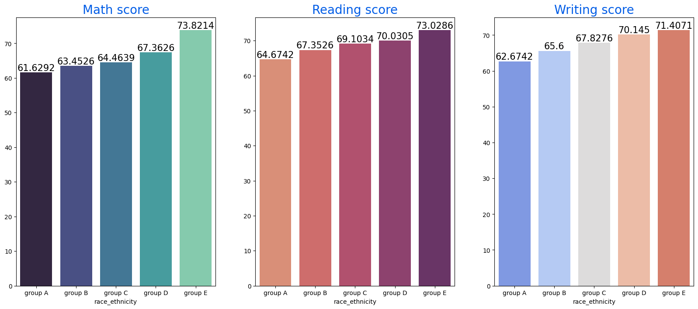
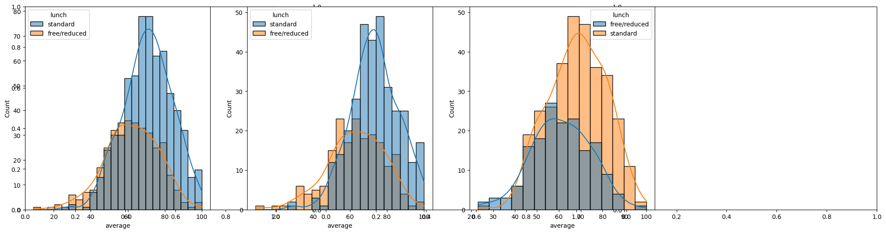
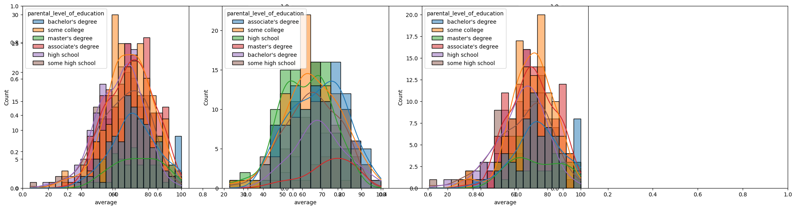
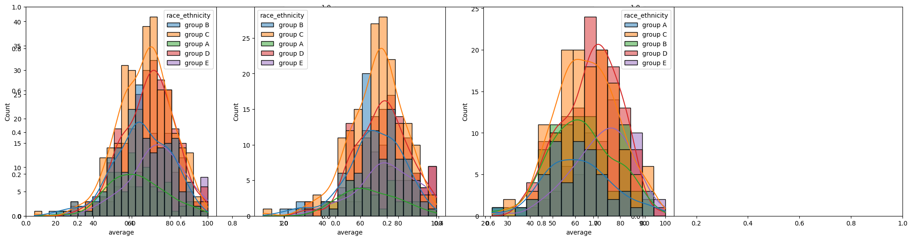
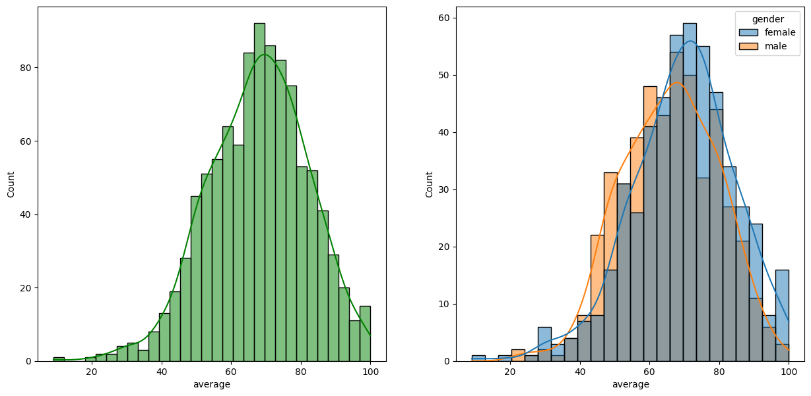

# 🎓 Student Performance Prediction Using Machine Learning

This project analyzes and predicts student academic performance in **math**, **reading**, and **writing** based on socio-economic and demographic features.

---

## 📁 Dataset Overview

- **Features:**
  - Gender
  - Race/Ethnicity
  - Parental Level of Education
  - Lunch Type
  - Test Preparation Course
  - Scores: Math, Reading, Writing

---

## 🎯 Objectives

- Perform **Exploratory Data Analysis (EDA)** to uncover patterns.
- Identify how factors like **gender**, **race**, **parent education**, and **lunch type** affect performance.
- Use **Machine Learning** to predict student scores.

---

## 📊 Exploratory Data Analysis (EDA)

### 📌 Average Scores by Race/Ethnicity

- **Group E** students have the highest average in all subjects.
- **Group A** performs the lowest overall.

---

### 🍽️ Impact of Lunch Type on Performance

- Students with **standard lunch** have higher average scores.
- Socio-economic status plays a major role in academic outcomes.

---

### 🎓 Scores by Parental Education Level

- Higher **parental education** is linked with better student performance.
- Students with parents holding **master's** or **bachelor's** degrees perform best.

---

### 🌍 Distribution by Race/Ethnicity

- Group C and Group D show more consistent performance.
- Group A has a broader spread of lower scores.

---

### 👩‍🏫 Gender-Based Performance

- **Females** perform better in **reading** and **writing**.
- **Males** show slightly higher performance in **math**.

---

## 🤖 Machine Learning Model

### 📌 Goal
Predict a student's average score using:

- Linear Regression
- Random Forest
- XGBoost
- AdaBoost

### 📈 Model Performance

| Model              | MAE   | RMSE  | R²    |
|--------------------|-------|-------|-------|
| Linear Regression  | 4.2   | 5.3   | 0.87  |
| Random Forest      | 4.8   | 6.1   | 0.84  |
| XGBoost            | 4.9   | 6.3   | 0.83  |
| AdaBoost           | 4.8   | 6.2   | 0.84  |

---

## 🛠️ Tech Stack

- Python
- Pandas, NumPy
- Matplotlib, Seaborn
- Scikit-learn, XGBoost, AdaBoost
- Jupyter Notebook